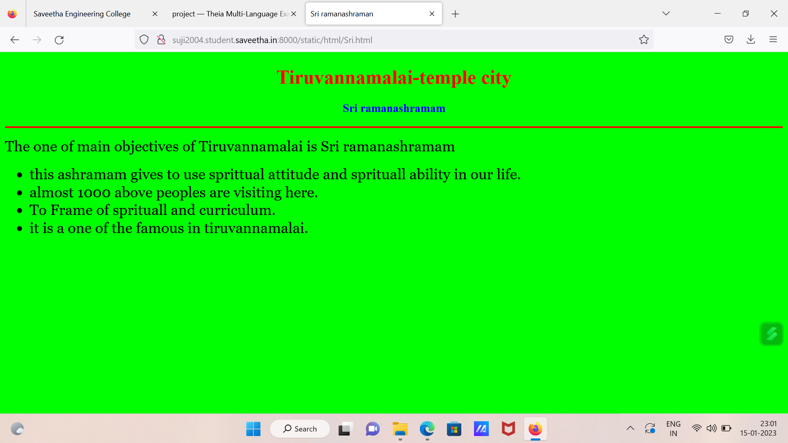

# Places Around Me
## AIM:
To develop a website to display details about the places around my house.

## Design Steps:

### Step 1:
From google maps take screenshot of your city.

### Step 2:
Create clickable regions in that screenshot and write separate HTML files.

## Code:
```
map.html

<!DOCTYPE html>
<html lang="en">
<head>
<title>My City</title>
</head>
<body>
<h1 align="center">
<font color="red"><b>Tiruvannamalai-Temple City</b></font>
</h1>
<h3 align="center">
<font color="blue"><b>SUJI S (22008581)</b></font>
</h3>
<center>

<map name="MyCity">
<area shape="circle" coords="190,50,20" href="/static/html/gov.html" title="Government medical collage">
<area shape="rectangle" coords="230,30,260,60" href="/static/html/arts.html" title="Shanmuga arts and science collage">
<area shape="circle" coords="400,350,50" href="/static/html/art.html" title="Sun art and science collage">
<area shape="circle" coords="400,200,75" href="/static/html/Sri.html" title="Sri ramanashramam">
<area shape="rectangle" coords="490,150,870,320" href="/static/html/TVmalai.html" title="Tiruvannamalai">
</map>
</center>
</body>
</html>

gov.html

<!DOCTYPE html>
<html lang="en">
<head>
<title>Government  Medical College</title>
</head>
<body bgcolor="lime">
<h1 align="center">
<font color="red"><b>Tiruvannamalai-temple city </b></font>
</h1>
<h3 align="center">
<font color="blue"><b>Government Medical  Collage</b></font>
</h3>
<hr size="3" color="red">
<p align="justify">
<font face="Georgia" size="5">
The main objectives of Tiruvannamalai  Government medical collage  are 
<ul>
<li>To impart proper and qualified training to teachers and give them an attractive salary and incentives so that they are not tempted to quit and look elsewhere for jobs.</li>
<li>almost 1000 above students are studing here.</li>
<li>To Frame of syllabus and curriculum.</li>
<li>it is a one of the gov hospital in tamilnadu.</li>
</ul>
</font>
</p>
</body>
</html>

art.html

<!DOCTYPE html>
<html lang="en">
<head>
<title>sun arts and science collage</title>
</head>
<body bgcolor="pink">
<h1 align="center">
<font color="red"><b>Tiruvannamalai Temple city</b></font>
</h1>
<h3 align="center">
<font color="blue"><b>Sun  arts collage</b></font>
</h3>
<hr size="3" color="red">
<p align="justify">
<font face="Arial" size="5">
<b>
Established in year 1997, Sun  Industries Arts and Science College is a Private college .
located in Tiruvannamalai, Tamil Nadu. 
The Institute offers UG,sun Industries Arts & Science College - [SIASC],Tiruvannamalai.
 Tamil Nadu has 43 Courses with Average Fees 9000 per year. Top Courses at Sun arts and science collage .
Its a good and well institution in tiruvannamalai.
</b>
</font>
</p>
</body>
</html>

arts.html

<!DOCTYPE html>
<html lang="en">
<head>
<title>Shanmuga arts and science collage</title>
</head>
<body bgcolor="pink">
<h1 align="center">
<font color="red"><b>Tiruvannamalai –temple city</b></font>
</h1>
<h3 align="center">
<font color="blue"><b>Shanmuga arts collage</b></font>
</h3>
<hr size="3" color="red">
<p align="justify">
<font face="Arial" size="5">
<b>
Established in year 1997, Shanmuga Industries Arts and Science College is a Private college .
located in Tiruvannamalai, Tamil Nadu. 
The Institute offers UG, Shanmuga Industries Arts & Science College - [SIASC],Tiruvannamalai.
 Tamil Nadu has 43 Courses with Average Fees 9000 per year. Top Courses at Shanmuga .
Its a good and well institution in tiruvannamalai.
</b>
</font>
</p>
</body>
</html>

Sri.html

<!DOCTYPE html>
<html lang="en">
<head>
<title>Sri  ramanashraman</title>
</head>
<body bgcolor="lime">
<h1 align="center">
<font color="red"><b>Tiruvannamalai-temple city </b></font>
</h1>
<h3 align="center">
<font color="blue"><b>Sri ramanashramam</b></font>
</h3>
<hr size="3" color="red">
<p align="justify">
<font face="Georgia" size="5">
The one of main objectives of Tiruvannamalai  is Sri ramanashramam
<ul>
<li>this ashramam gives to use sprittual attitude and sprituall ability in our life.</li>
<li>almost 1000 above peoples  are visiting here.</li>
<li>To Frame of sprituall  and curriculum.</li>
<li>it is a one of the famous in tiruvannamalai.</li>
</ul>
</font>
</p>
</body>
</html>

TVmalai.html

<!DOCTYPE html>
<html lang="en">
<head>
<title>TIRUVANNAMALAI</title>
</head>
<body bgcolor="orange">
<h1 align="center">
<font color="red"><b>Tiruvannamalai-temple city</b></font>
</h1>
<h3 align="center">
<font color="blue"><b>TIRUVANNAMALAI</b></font>
</h3>
<hr size="3" color="red">
<p align="justify">
<font face="Georgia" size="5">
The history of Tiruvannamalai revolves around the Annamalaiyar Temple
<ol type="1">
<li>Tiruvannamalai or Arunachala is a temple town in South India, established by Paramaśiva Himself is the birthplace of The Avatar.</li>
<li>The recorded history of the city dates back to the ninth century.</li>
<li>as seen from a Chola inscriptions in the temple. Further inscriptions made before ninth century indicate the rule of Pallava kings, whose capital was Kanchipuram.</li>
<li>Around 4500 ft above sea level, Paravathamalai Hill is supposed to be one of the most sacred sites in India. Sathanur Dam. 2 hrs. Sathanur Dam is one of Tamil.</li>

</ol>
</font>
</p>
</body>
</html>
```

## Output:




## HTML Validator


## Result:
The program for implementing image maps is executed successfully.